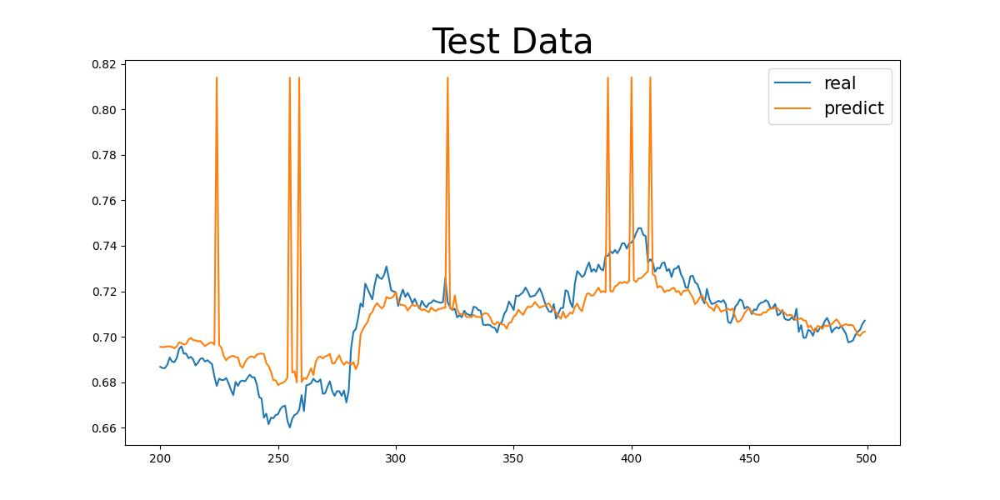

# QData Time Series Data Fitting

- Model：CNN + LSTM + CBAM(attention)

| Model                | RMSE                  |
|-------------------|-----------------------|
| CNN + LSTM + CBAM | 0.0003162174993617968 |

## Data
Accuracy of raw data: 5 minutes aggregation (dataset size 6.1GB), download address:, decompress password: `123`

1. load data into QData
2. Use `create_label.py`, `create_train_data1.py`, `create_train_data2.py` to process the raw data into a pre-training format suitable for training.
3. The pre-training data is unpacked and has a volume of about 200GB in memory (estimated) and is loaded into memory using numpy memory segment mapping. The data is managed by QData


Translated with DeepL.com (free version)

## Training
```python
python train.py
```
The model will exist under the best_model path

## Test
```python
python test.py
```
Predicted results will exist under result_picture

## Predict the results


## CNN + LSTM + CBAM


