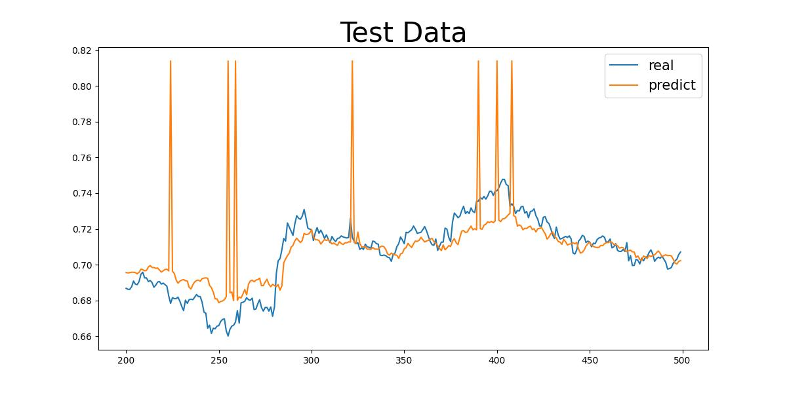

# QData 时序数据拟合

- 模型：CNN + LSTM + CBAM(attention)

| 模型                | RMSE                  |
|-------------------|-----------------------|
| CNN + LSTM + CBAM | 0.0003162174993617968 |

# 数据
原始数据精度：5分钟聚合(数据集大小6.1GB)，下载地址：，解压密码:123

1. 将数据载入QData
2. 使用`create_label.py`, `create_train_data1.py`, `create_train_data2.py` 将原始数据处理为适合训练的预训练格式。
3. 预训练数据解压后在内存中体积约为200GB左右（估算），采用numpy内存分段映射方式载入内存。数据由QData驱动

# 训练
```python
python train.py
```
模型会存在best_model路径下

# 测试
```python
python test.py
```
预测结果会存在result_picture下

# 预测结果

## CNN + LSTM + CBAM


